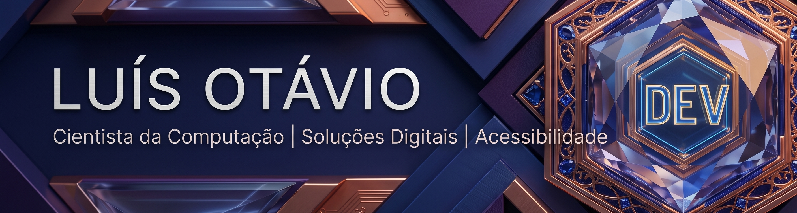

 

> [!NOTE]
> **About me**
> Bem-vindo ao meu perfil do GitHub! Sou Cientista da Computação formado pelo IFSULDEMINAS. Tenho experiência prática no desenvolvimento de soluções diversificadas, desde sistemas aplicados até pesquisa em Inteligência Artificial. Dentre meus projetos, destaco o "Donate Found" (um mini sistema de doações), o desenvolvimento de um compilador para drones estruturado em Java e a aplicação de Visão Computacional na área médica (EfficientNet e U-Net). Também atuo na criação de ferramentas focadas em acessibilidade digital.

### My Go-To Technologies

  
  
  
  
  

### GitHub Stats

  

### Let's Connect

  
  
  

 

By Luís Otávio
